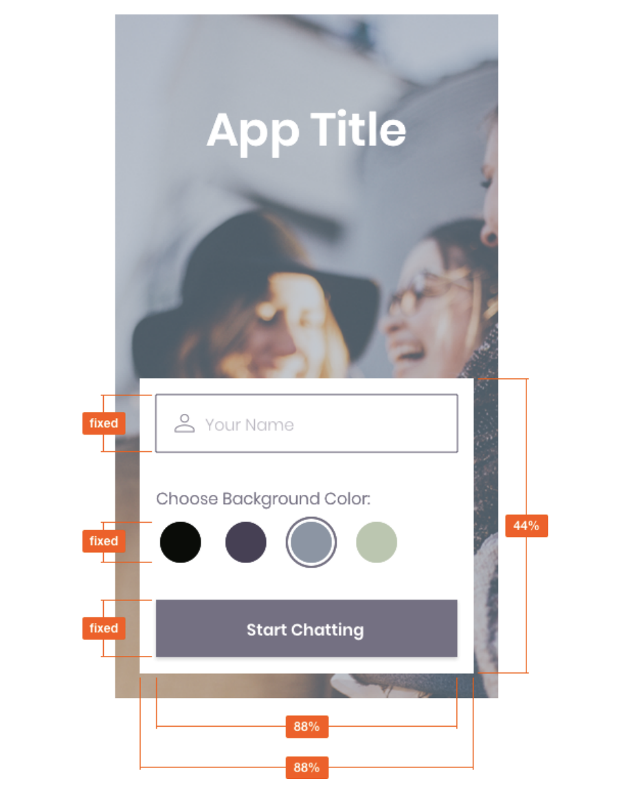

# Chat App Chatster

## Objective

**To build a chat app for mobile devices using React Native. The app will
provide users with a chat interface and options to share images and their
location.**

## Context

More and more people use their phones for daily tasks, such as shopping, creating to-do lists,
communicating with friends, scheduling meetings, and more. That's why many companies offer native
mobile versions of their web apps, or even skip creating a web app entirely.
In the past, building high-quality mobile apps required a lot of time and money because writing apps
for different platforms like iOS and Android required specialized programmers who could build and
maintain multiple codebases.
Over time, however, new technologies emerged that made it easier for companies to build and
maintain mobile applications using familiar syntax. One of these technologies is React Native, a
framework for building Android and iOS apps that only requires one codebase.
For this project i've used React Native, Expo, and Google Firestore Database to build a
chat app that demonstrate my knowledge of JavaScript mobile
development.

## The 5 Ws

1. Who—The users of the mobile chat app. These could be friends, family or anyone.
2. What—A native chat app built with React Native, as well as all the relevant documentation.
3. When—Whenever users of the chat app want to communicate with each other.
4. Where—The app will be optimized for both Android and iOS devices. I have used
   Expo to develop the app and Google Firestore to store the chat messages.
5. Why—Mobile chat apps are among the most commonly downloaded and used apps
   in the world, so knowing how to build a chat app is an indispensable skill. The app
   demonstrates my React Native development skills.

## Features and Requirements

### User Stories

- As a new user, I want to be able to easily enter a chat room so I can quickly start talking to my friends and family.
- As a user, I want to be able to send messages to my friends and family members to exchange
  the latest news.
- As a user, I want to send images to my friends to show them what I’m currently doing.
- As a user, I want to share my location with my friends to show them where I am.
- As a user, I want to be able to read my messages offline so I can reread conversations at any
  time.
- As a user with a visual impairment, I want to use a chat app that is compatible with a screen
  reader so that I can engage with a chat interface.

### Key Features

- A page where users can enter their name and choose a background color for the chat screen
  before joining the chat.
- A page displaying the conversation, as well as an input field and submit button.
- The chat must provide users with two additional communication features: sending images
  and location data.
- Data gets stored online and offline.

### Technical Requirements

- The app must be written in React Native.
- The app must be developed using Expo.
- The app must be styled according to the given screen design.
- Chat conversations must be stored in Google Firestore Database.
- The app must authenticate users anonymously via Google Firebase authentication.
- Chat conversations must be stored locally.
- The app must let users pick and send images from the phone’s image library.
- The app must let users take pictures with the device’s camera app, and send them.
- The app must store images in Firebase Cloud Storage.
- The app must be able to read the user’s location data.
- Location data must be sent via the chat in a map view.
- The chat interface and functionality must be created using the Gifted Chat library.
- The app’s codebase must contain comments.

## Screen Design & Assets



### Design Specifications

- Vertical and horizontal spacing: evenly distributed
- App title: font size 45, font weight 600, font color #FFFFFF
- “UserName”: font size 16, font weight 300, font color #757083, 50% opacity
- “Choose background color”: font size 16, font weight 300, font color #757083, 100% opacity
- Color options HEX codes: #090C08; #474056; #8A95A5; #B9C6AE
- Start chatting button: font size 16, font weight 600, font color #FFFFFF, button color #757083

## How to set up the application

As this application requires react native and is developped with Expo, the first step involves downgrading (if necessary) to a node version compatible with Expo:

- npm install 16.19.0
- npm use 16.19.0
- npm alias default 16.19.0

Next, install expo CLI on your machine:

- npm install -g expo-cli

**Android Studio:** If you plan to run the app on an Android emulator, you'll need to set up Android Studio. Follow the official Expo guide for instructions on setting up the Android development environment: [Expo Android Development Environment](https://docs.expo.dev/workflow/android-studio-emulator/)

Before running the app, make sure to install the required dependencies using npm or yarn:
(Expo only supports Node up to version 16.19.0, please ensure you are using this version)

npm install
@react-native-async-storage/async-storage
@react-native-community/netinfo
@react-navigation/native
@react-navigation/native-stack
expo firebase
react-native
react-native-gifted-chat
react-native-safe-area-context
react-native-screens
expo-image-picker
expo-location
react-native-maps

This will install all the dependencies needed to run the app.

## Database Configuration

This app uses Firebase as the backend database. To configure Firebase:

- Visit the [Firebase Console](https://console.firebase.google.com/) and create a new project if you don't have one already. In the "Rules" tab, change "allow read, write: if false;" to "allow read, write: if true;"

- Set up Firebase Authentication (Anonymous Authentication is used in this app) and Firestore Database. Make sure to enable anonymous authentication in Firebase.

- Obtain the Firebase configuration object for your project. It should look something like this:

```javascript
const firebaseConfig = {
	apiKey: 'YOUR_API_KEY',
	authDomain: 'YOUR_AUTH_DOMAIN',
	projectId: 'YOUR_PROJECT_ID',
	storageBucket: 'YOUR_STORAGE_BUCKET',
	messagingSenderId: 'YOUR_MESSAGING_SENDER_ID',
	appId: 'YOUR_APP_ID',
	measurementId: 'YOUR_MEASUREMENT_ID',
};
```

In the App.js file of your project, replace the firebaseConfig object with your own Firebase configuration.

## Running the App

Now that you've set up the environment and Firebase, you can run the app:

expo start or npm start

This command will start the Expo development server, and you can run the app on an emulator or a physical device using the expo Go App

(expo start -c to clear cache)
(expo start --offline for offline testing)
